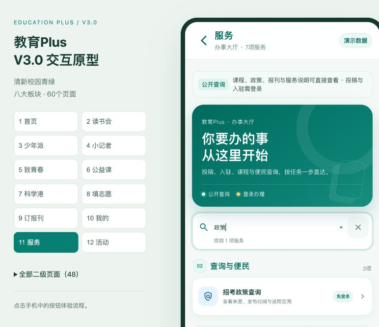
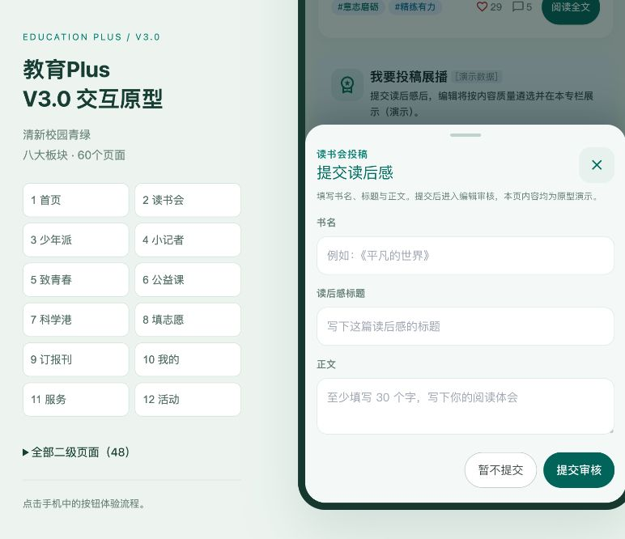
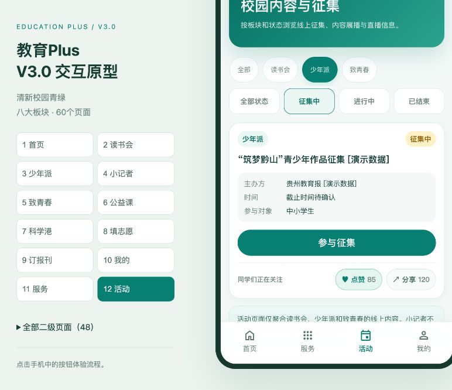

# 教育Plus V3.0 产品设计与交互审计

审计日期：2026-09-22  
审计范围：首页、八个业务板块、我的、服务、活动及 48 个二级页面，共 60 个路由。  
基准版本：GitHub Pages `62f91b8`，修正后本地版本 `20260922-product-audit-v1`。

## 结论

60 个页面均可渲染，八个板块的顶部结构、内容卡片、底部导航和栏目视觉保持在同一套 390px 校园青绿体系内。公开内容、登录后内容、点赞收藏分享、搜索、筛选、投稿、入驻与审核入口的边界清楚。审计发现的 5 项交互缺口已修正，没有遗留的原型阻断问题。

## 核心流程检查

| 步骤 | 检查内容 | 结果 | 证据 |
|---|---|---|---|
| 1 | 首页首屏、八个入口、内容推荐与底部导航 | 健康 | `01-home.jpg`、`route-01-1.jpg` |
| 2 | 读书会同级子目录、列表、详情、书库和校园读书会 | 健康 | `route-02-2.jpg`、`route-38-R01.jpg` 至 `route-47-R13.jpg` |
| 3 | 少年派作品、赛事、投稿、进度、指导和成长档案 | 健康 | `route-03-3.jpg`、`route-48-S01.jpg` 至 `route-53-S06.jpg` |
| 4 | 小记者作品、在线投稿、入驻和资格审核 | 健康 | `route-04-4.jpg`、`route-23-J01.jpg` 至 `route-30-J08.jpg` |
| 5 | 致青春校园内容、社团入驻、官方活动和创作发布 | 健康 | `route-05-5.jpg`、`route-56-Y01.jpg` 至 `route-60-Y05.jpg` |
| 6 | 公益课搜索、课程详情、直播说明和回放 | 健康 | `route-06-6.jpg`、`route-13-C01.jpg` 至 `route-15-C03.jpg` |
| 7 | 科学港内容、作品提交、个人作品和编辑答疑 | 健康 | `route-07-7.jpg`、`route-31-K01.jpg` 至 `route-35-K05.jpg` |
| 8 | 填志愿公开信息和第三方服务边界 | 健康 | `route-08-8.jpg`、`issue-V01-recheck.jpg`、`route-55-V02.jpg` |
| 9 | 订报刊版面展读和外部订阅说明 | 健康 | `route-09-9.jpg`、`route-36-N01.jpg`、`route-37-N02.jpg` |
| 10 | 我的、消息、收藏、活动、投稿和个人资料 | 健康 | `route-10-10.jpg`、`route-16-G01.jpg` 至 `route-22-G07.jpg` |
| 11 | 服务搜索、五类投稿入口、登录门槛 | 健康 | `interaction-service-search.jpg`、`interaction-service-submission-sheet.jpg` |
| 12 | 活动联合筛选、点赞状态、投稿表单、重置与加载反馈 | 健康 | `interaction-activity-like.jpg`、`interaction-reading-login-gate.jpg`、`interaction-reading-submission-form.jpg` |

## 已修正问题

1. **首次打开复杂二级页会短暂显示空白。** 原型容器现在显示“页面加载中”状态，并通过 `aria-busy` 和 `role=status` 同步给辅助技术；页面完成后自动关闭。
2. **读后感“提交读后感”在已登录状态下无后续动作。** 现已补齐书名、标题、正文表单、必填校验、处理中状态、提交成功反馈和本地演示记录。
3. **底部导航可能覆盖投稿弹层按钮，登录弹层也可能被投稿弹层遮挡。** 已重新定义弹层层级：业务表单高于全局导航，登录提示高于业务表单。
4. **消息页两处 `data-path` 详情按钮不进入目标页面。** 路由器现会识别合法的页面目标标识，分别进入投稿进度页。
5. **“重置本次演示”未清除登录、互动和部分投稿状态。** 现统一清理所有 `ep-` 前缀状态并重新加载首页。

## 视觉与可访问性

- 页面使用一致的清新校园青绿、白色内容卡、统一圆角和固定底部导航。
- 八个板块的一级结构一致；二级内容根据业务类型使用列表、详情、表单或服务目录，不强行复制同一种内容布局。
- 60 个页面在 390px 视口下无横向溢出。
- 自动检查确认图片均有 `alt` 属性，交互控件均有可访问名称。
- 弹层支持关闭按钮和 `Escape`；表单错误使用原生校验与可见错误信息；加载动画遵循 `prefers-reduced-motion`。

## 证据总览

六张联系表覆盖全部 60 个页面：`contact-01.png` 至 `contact-06.png`。单页证据为 `route-01-1.jpg` 至 `route-60-Y05.jpg`。J02 和 V01 的延迟复测分别保存在 `issue-J02-recheck.jpg`、`issue-V01-recheck.jpg`。

## 验证限制

本次验证覆盖原型内的页面、导航、搜索、筛选、表单、状态持久化和登录边界。视频号、正式直播、支付订阅、真实微信登录、正式审核后台和第三方升学服务仍是待接入能力；本报告不把这些演示反馈视为真实业务接入完成。自动检查未替代完整的 WCAG 人工审计，颜色对比、真实屏幕阅读器朗读和多设备手势仍需在正式开发阶段补做。
